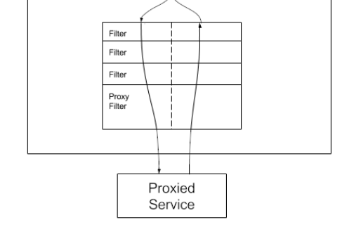

# OpenAPI

背景：

1. 前端开发需要用到后端接口

2. 使用现成的系统的功能

   

做一个api开放平台：

1. 防止攻击（安全性）
2. 不能随便调用（限制、开通）
3. 统计调用次数
4. 计费
5. 流量保护
6. API接入

## 项目介绍

做一个提供API接口调用的平台，用户可以注册登录，开通接口调用权限。用户可以使用接口，并且每次调用会进行统计。管理员可以发布接口、下线接口、接入接口，以及可视化的调用情况（数据）


### 业务流程


后台管理系统：http://localhost:7529

用户前台：http://localhost:8000

API网关：http://locathost:8090

模拟接口：http://localhost:8123

### 技术选型

#### 后端

- Java Spring Boot
- Spring Boot Starter（SDK开发）
- Dubbo（RPC）
- Nacos
- Spring Cloud Gateway（网关，限流，日志实现）

### 需求分析

1. 管理员可以对接口信息进行增删改查
2. 用户可以访问前台，查看接口信息


## 数据库表设计

### 接口信息表

id

name

userId 创建人id

url 接口地址

method 请求类型

requestHeader 请求头

respondHeader 响应头

status 接口状态（0-关闭 1-开启）

isDelete

createTime

updateTime


## 业务实现


### 接口功能 实现


#### 调用接口

几种HTTP调用方式：

1. HttpClient
2. RestTemplate
3. 第三方库（OKHTTP、HuTool[Hutool🍬一个功能丰富且易用的Java工具库，涵盖了字符串、数字、集合、编码、日期、文件、IO、加密、数据库JDBC、JSON、HTTP客户端等功能。](https://hutool.cn/)）

```java
private static final String GATEWAY_HOST = "http://localhost:8090";
 public String getNameByGet(String name) {
        //可以单独传入http参数，这样参数会自动做URL编码，拼接在URL中
        HashMap<String, Object> paramMap = new HashMap<>();
        paramMap.put("name", name);
        String result = HttpUtil.get(GATEWAY_HOST + "/api/name/", paramMap);
        System.out.println(result);
        return result;
```


### API签名认证

#### 本质：

1. 签发签名

   > 可以用户注册时分配签名
   >
   > 扩展：用户可以申请更换签名

2. 校验签名

为什么需要？

1. 保证安全性，不能随便调用（进行限制）


#### 实现：

- **accessKey**：调用的标识 user（尽量复杂、无序、无规律）

- **secretKey**：密钥（该参数不能放到请求头中）

  类似用户名密码，区别：ak/sk无状态，每次请求都必须要有

  **！！！千万不要把密钥直接在服务器之间传递（可能会被拦截，泄露密钥）**

- **用户参数**

- **sign**：签名

  加密方式：对称加密、非对称加密、md5签名（不可解密）

  用户参数+密钥=>签名算法（MD5、HMac、Sha1）=>不可解密的值（怎么确定密钥对不对？服务端用同样的参数和算法去生成签名，校验和客户端传入的签名是否一致）

- **nonce**：随机数

- **timestamp**：时间戳

  **防重放**

  加nonce随机数，只能用一次（服务端要保存用过的随机数）

  加timestamp时间戳，校验时间戳是否过期

```java
public class YuApiClient {

    private static final String GATEWAY_HOST = "http://localhost:8090";

    private String accessKey;

    private String secretKey;

    public YuApiClient(String accessKey, String secretKey) {
        this.accessKey = accessKey;
        this.secretKey = secretKey;
    }

    public String getNameByGet(String name) {
        //可以单独传入http参数，这样参数会自动做URL编码，拼接在URL中
        HashMap<String, Object> paramMap = new HashMap<>();
        paramMap.put("name", name);
        String result = HttpUtil.get(GATEWAY_HOST + "/api/name/", paramMap);
        System.out.println(result);
        return result;
    }

    public String getNameByPost(String name) {
        //可以单独传入http参数，这样参数会自动做URL编码，拼接在URL中
        HashMap<String, Object> paramMap = new HashMap<>();
        paramMap.put("name", name);
        String result = HttpUtil.post(GATEWAY_HOST + "/api/name/", paramMap);
        System.out.println(result);
        return result;
    }

    private Map<String, String> getHeaderMap(String body) {
        Map<String, String> hashMap = new HashMap<>();
        hashMap.put("accessKey", accessKey);
        // 一定不能直接发送
//        hashMap.put("secretKey", secretKey);
        hashMap.put("nonce", RandomUtil.randomNumbers(4));
        hashMap.put("body", body);
        hashMap.put("timestamp", String.valueOf(System.currentTimeMillis() / 1000));
        hashMap.put("sign", genSign(body, secretKey));
        return hashMap;
    }

    public String getUsernameByPost(User user) {
        String json = JSONUtil.toJsonStr(user);
        HttpResponse httpResponse = HttpRequest.post(GATEWAY_HOST + "/api/name/user")
                .addHeaders(getHeaderMap(json))
                .body(json)
                .execute();
        System.out.println(httpResponse.getStatus());
        String result = httpResponse.body();
        System.out.println(result);
        return result;
    }
}
```

API签名认证是一个很灵活的设计，具体有哪些参数，参数名如何一定要根据场景来。比如（userId，appId，version，固定值等）

​	

### 开发一个简单易用的sdk

> 开发者只需关心调用哪些接口、传递哪些参数，就跟调用自己的代码一样简单

开发starter的好处：开发者引入之后，可以直接在application.yml中写配置，自动创建客户端


spring-boot-configuration-professor的作用是自动生成配置的代码提示


创建starter步骤

1. 创建spring-boot项目（引入spring-configuration-professor）

2. 删除配置文件中的以下部分：

   ```xml
   <build>
       <plugins>
           <plugin>
               <groupId>org.springframework.boot</groupId>
               <artifactId>spring-boot-maven-plugin</artifactId>
               <configuration>
                   <excludes>
                       <exclude>
                           <groupId>org.projectlombok</groupId>
                           <artifactId>lombok</artifactId>
                       </exclude>
                   </excludes>
               </configuration>
           </plugin>
       </plugins>
   </build>
   ```

3. 删除启动类

4. 创建配置类

   ```java
   @Configuration
   @ConfigurationProperties("yuapi.client")//@ConfigurationProperties和@Value注解用于获取配置文件中的属性定义并绑定到Java Bean或属性中
   @Data
   @ComponentScan//这个注解会让spring去扫描某些包及其子包中所有的类，然后将满足一定条件的类作为bean注册到spring容器容器中。
   public class YuApiClientConfig {
   
       private String accessKey;
   
       private String secretKey;
   
       @Bean
       public YuApiClient yuApiClient() {
           return new YuApiClient(accessKey, secretKey);
       }
   
   }
   ```


5. 在resources目录下创建META-INF文件

   

   并指定第4步创建的配置类的包引用

6. 打包

   

7. 在其他项目中引入该依赖

可以把打好的包发到maven仓库中，这样其他人就可以通过引入依赖的方式来使用该sdk


### 开发接口发布/上线的功能（管理员）

发布接口：

1. 校验该接口是否存在
2. 判断该接口是否可以调用
3. 修改接口数据库中的状态字段为1


下线接口：

1. 校验接口是否存在

2. 修改接口数据库中的状态字段为0

   

### 在线调用接口

请求参数的类型（直接用json格式，更灵活）：

``` json
[
    {"name":"username","type":"string"}
]
```


调用流程：


1. 前端将用户输入的请求参数和要测试的接口id发给后端
2. 在调用前可以做一些校验
3. 后端去调用模拟接口


### 统计接口调用次数

需求：

1. 用户每次调用接口成功，次数+1
2. 给用户分配或用户自主获取调用接口次数

业务流程：

1. 用户调用接口
2. 修改数据库，调用次数+1

#### 设计数据库表

用户<==>接口（多对多）

用户接口关系表

```sql
-- 用户调用接口关系表
create table if not exists openapi.`user_interface_info`
(
    `id` bigint not null auto_increment comment '主键' primary key,
    `userId` bigint not null comment '调用用户 id',
    `interfaceInfoId` bigint not null comment '接口 id',
    `totalNum` int default 0 not null comment '总调用次数',
    `leftNum` int default 0 not null comment '剩余调用次数',
    `status` int default 0 not null comment '0-正常，1-禁用',
    `createTime` datetime default CURRENT_TIMESTAMP not null comment '创建时间',
    `updateTime` datetime default CURRENT_TIMESTAMP not null on update CURRENT_TIMESTAMP comment '更新时间',
    `isDelete` tinyint default 0 not null comment '是否删除(0-未删, 1-已删)'
) comment '用户调用接口关系';
```

#### 实现

1. 开发基本增删改查
2. 开发用户调用接口次数+1的功能(service)


问题：如果每个接口的方法都写调用次数+1，会比较麻烦

致命问题：接口开发者需要自己去添加统计代码

解决方法：

1. AOP：独立于接口，在每个接口调用后统计次数+1（但只能存在于单个项目中，如果多个团队开发多个接口，就需要都写一个aop）
2. seevlet拦截器（过滤器）
3. 网关


## 网关

**统一**去进行一些操作、处理一些问题

### 作用

1. **路由**

   起到转发的作用，比如有接口A和接口B，网关会记录这些信息，根据用户访问的地址和参数，转发请求到对于的接口（服务器/集群）

   /a=> 接口A

   /b=> 接口B

2. **负载均衡**（需要用到注册中心）

   /c=> 服务A/集群A（随机转发到其中的某一个机器）

   uri从固定地址改成lb:xxx

3. **鉴权**

   统一去判断用户是否有权限操作

4. **跨域**

   网关统一处理跨域，这样就不用在某个项目里单独处理

   [CORS Configuration :: Spring Cloud Gateway](https://docs.spring.io/spring-cloud-gateway/reference/spring-cloud-gateway/cors-configuration.html)

5. **统一业务处理**（缓存）

   把一些通用逻辑放到上层（网关），统一处理，比如本项目中的次数统计

6. **访问控制**

   黑白名单，比如限制DDOS IP

7. **发布控制**

   灰度发布，比如上线新接口，先给新街口分配20%的流量，老接口80%，再慢慢调整比重

   [Route Predicate Factories :: Spring Cloud Gateway](https://docs.spring.io/spring-cloud-gateway/reference/spring-cloud-gateway/request-predicates-factories.html#weight-route-predicate-factory)

8. **流量染色**

   给请求（流量）添加一些标识，一般是设置请求头

   [AddRequestHeader GatewayFilter](https://docs.spring.io/spring-cloud-gateway/reference/spring-cloud-gateway/gatewayfilter-factories/addrequestheader-factory.html)

   全局染色：[Default Filters :: Spring Cloud Gateway](https://docs.spring.io/spring-cloud-gateway/reference/spring-cloud-gateway/gatewayfilter-factories/default-filters.html)

9. **接口保护**

   1. 限制请求

      https://docs.spring.io/spring-cloud-gateway/docs/current/reference/html/#requestheadersize-gatewayfilter-factory

   2. 信息脱敏

      https://docs.spring.io/spring-cloud-gateway/docs/current/reference/html/#the-removerequestheader-gatewayfilter-factory

   3. 降级（熔断）

      https://docs.spring.io/spring-cloud-gateway/docs/current/reference/html/#fallback-headers

   4. 限流：学习令牌桶算法、学习漏桶算法、RedisLimitHandler

      https://docs.spring.io/spring-cloud-gateway/docs/current/reference/html/#the-requestratelimiter-gatewayfilter-factory

   5. 超时时间

      https://docs.spring.io/spring-cloud-gateway/docs/current/reference/html/#http-timeouts-configuration

   6. 重试（业务保护）

      https://docs.spring.io/spring-cloud-gateway/docs/current/reference/html/#the-retry-gatewayfilter-factory

10. **统一日志**

    统一地记录请求响应日志

11. **统一文档**

    将下游项目的文档进行聚合，在一个页面统一查看
    
    建议用：https://doc.xiaominfo.com/docs/middleware-sources/aggregation-introduction
    
    

### 分类

1. 全局网关（接入层网关）：作用是负载均衡、请求日志等，不和具体的业务逻辑绑定
2. 业务网关（微服务网关）：会有一些业务逻辑，作用是将请求转发到不同的业务/项目/接口/服务

#### 实现

1. Nginx（全局网关），kong网关（API网关），编程成本较高[Kong/kong: 🦍 The Cloud-Native API Gateway and AI Gateway. (github.com)](https://github.com/Kong/kong)
2. Spring Cloud Gateway（取代了Zuul）性能高、可以用java代码来写逻辑

[微服务网关选型：5种主流 API 网关，哪个最香！ ](https://zhuanlan.zhihu.com/p/500587132)


### Spring Cloud Gateway

看官方文档[Spring Cloud Gateway](https://docs.spring.io/spring-cloud-gateway/reference/spring-cloud-gateway.html)

##### 核心概念

- 路由：根据什么条件，转发到那里

- 断言：一组规则、条件，用来确定如何转发路由

  1. After 在xx时间之后
  2. Before 在xx时间之前
  3. Between 在xx时间之间
  4. Cookie 
  5. Header 请求头
  6. Method 请求类型
  7. Path  路径
  8. Query  查询参数
  9. RemoteAddr 客户端地址
  10. Weight 权重

  [Route Predicate Factories :: Spring Cloud Gateway](https://docs.spring.io/spring-cloud-gateway/reference/spring-cloud-gateway/request-predicates-factories.html)

- 过滤器：对请求进行一系列处理，如添加请求头，添加请求参数等（对请求头，请求参数、响应头的增删改查）

  1. 添加请求头

  2. 添加请求参数

  3. 添加响应头

  4. 降级

     [CircuitBreaker GatewayFilter Factory :: Spring Cloud Gateway](https://docs.spring.io/spring-cloud-gateway/reference/spring-cloud-gateway/gatewayfilter-factories/circuitbreaker-filter-factory.html)

     需引入如下依赖：

     ```xml
     <dependency>
         <groupId>org.springframework.cloud</groupId>
         <artifactId>spring-cloud-starter-circuitbreaker-reactor-resilience4j</artifactId>
     </dependency>
     ```

  5. 限流[RequestRateLimiter GatewayFilter Factory :: Spring Cloud Gateway](https://docs.spring.io/spring-cloud-gateway/reference/spring-cloud-gateway/gatewayfilter-factories/requestratelimiter-factory.html)
  
     


##### 请求流程：

1. 客户端发起请求
2. Handler Mapping：根据断言将请求转发到对应的路由
3. Web handler：处理请求（一层层经过过滤器）
4. 调用实际服务 


##### 两种配置方式

1. 配置式（方便规范）

   1. 简化版

      ```yaml
      spring:
        cloud:
          gateway:
            routes:
            - id: after_route
              uri: https://example.org
              predicates:
              - Cookie=mycookie,mycookievalue
      ```

      

   2. 全称式

      ```yaml
      spring:
        cloud:
          gateway:
            routes:
            - id: after_route
              uri: https://example.org
              predicates:
              - name: Cookie
                args:
                  name: mycookie
                  regexp: mycookievalue
      ```

   **建议开启日志**

   ```yaml
   logging:
     level:
       org:
         springframework:
           cloud:
             gateway: trace
   ```

   

2. 编程式（灵活，相对麻烦）

```java
@SpringBootApplication
public class DemogatewayApplication {
    @Bean
    public RouteLocator customRouteLocator(RouteLocatorBuilder builder) {
        return builder.routes()
                .route("path_route", r -> r.path("/get")
                        .uri("http://httpbin.org"))
                .route("host_route", r -> r.host("*.myhost.org")
                        .uri("http://httpbin.org"))
                .route("rewrite_route", r -> r.host("*.rewrite.org")
                        .filters(f -> f.rewritePath("/foo/(?<segment>.*)", "/${segment}"))
                        .uri("http://httpbin.org"))
                .route("hystrix_route", r -> r.host("*.hystrix.org")
                        .filters(f -> f.hystrix(c -> c.setName("slowcmd")))
                        .uri("http://httpbin.org"))
                .route("hystrix_fallback_route", r -> r.host("*.hystrixfallback.org")
                        .filters(f -> f.hystrix(c -> c.setName("slowcmd").setFallbackUri("forward:/hystrixfallback")))
                        .uri("http://httpbin.org"))
                .route("limit_route", r -> r
                        .host("*.limited.org").and().path("/anything/**")
                        .filters(f -> f.requestRateLimiter(c -> c.setRateLimiter(redisRateLimiter())))
                        .uri("http://httpbin.org"))
                .build();
    }
}
```


### 用到的特性

1. 路由（转发请求到模拟接口项目）
2. 统一鉴权（accessKey、secretKey）
3. 统一业务处理（每次调用接口后，调用次数+1）
4. 访问控制（黑白名单）
5. 流量染色（记录请求是否为网关来的）
6. 接口保护
7. 统一日志（记录每次的请求和响应日志）

### 业务逻辑

1. 用户发送请求到API网关

2. 记录请求日志

3. （黑白名单）

4. 用户鉴权（判断ak、sk是否存在）

   去数据库中查询是否已分配密钥给用户：

   1. 先根据accessKey判断用户是否存在，根据用户信息及secretKey生成算法重新生成secretKey
   2. 对比数据库中存储的secretKey与当前生成的secretKey是否一致

5. 请求的模拟接口是否存在 

6. 网关转发请求，调用模拟接口

7. 记录响应日志

8. 调用成功，接口调用次数+1

9. 调用失败，返回一个规范的错误码

   

### 业务实现

1. 请求转发

   使用前缀匹配路由器https://docs.spring.io/spring-cloud-gateway/docs/current/reference/html/#the-path-route-predicate-factory

   所有路径为：/api/**的请求进行转发，转发到http://localhost:8123/api/**(模拟接口)

   比如请求网关：http://localhost:8090/api/name/get?name=test （网关）

   转发到：http://localhoost:8123/api/get?name=test （模拟接口）

   ``` yaml
   spring:
     cloud:
       gateway:
         default-filters:
           - AddResponseHeader=source, yupi
         routes:
           - id: api_route
             uri: http://localhost:8123
             predicates:
               - Path=/api/**
   ```

   

2. 编写业务逻辑

   使用Global Filter进行全局拦截处理（类似AOp）

   （因为网关项目没有引入mybatis等操作数据库的类库，如果需要操作数据库的操作较为复杂，可以由backend增删改查项目提供接口，直接调用即可）

   - HTTP请求（HTTPClient、RestTemplate、Feign）提供一个接口，供其他项目去引用
   - RPC（Dubbo）
   - 把公共的代码打成jar包，其他项目去引用（客户端SDK）

   **问题**

   预期是等模拟接口调用完成，再记录响应日志，统计调用次数

   但chain.fliter方法立刻执行了日志记录及次数统计的业务，直到filter过滤器return后才调用了模拟接口

   

   原因：chain.filter是异步操作

   解决方案：利用response装饰器，增强原有response的处理能力

   参考博客：https://blog.csdn.net/qq_19636353/article/details/126759522

   其他参考：

   - https://blog.csdn.net/m0_67595943/article/details/124667975
   - [https://blog.csdn.net/weixin_43933728/article/details/121359727](https://blog.csdn.net/weixin_43933728/article/details/121359727?spm=1001.2014.3001.5501)
   - https://blog.csdn.net/zx156955/article/details/121670681
   - https://blog.csdn.net/qq_39529562/article/details/108911983

   


### 调用其他项目的方法


#### HTTP请求

1. 提供方开发一个接口（地址、请求方法、参数、返回值）
2. 调用方使用HTTPClient之类的代码包去发送HTTP请求

#### RPC（Remote Procedure Call Protocol 远程过程调用协议）

作用：像调用本地方法一样调用远程方法，对开发者更透明，减少了很多沟通的成本

RPC向远程服务器发送请求时，未必要使用HTTP协议，比如TCP/IP协议，性能更高（内部服务更适用）

RPC调用模型：


RPC实现：Dubbo框架、GRPC、TRPC

### Dubbo框架

学习方法：读官方文档[Dubbo 入门 | Apache Dubbo](https://cn.dubbo.apache.org/zh-cn/overview/quickstart/)

底层是Triple协议

两种使用方式：

1. Spring Boot代码（注解+编程式）：写java接口，服务提供者和消费者都去引用这个接口

2. IDL（接口调用语言）[使用 IDL 定义与开发服务 | Apache Dubbo](https://cn.dubbo.apache.org/zh-cn/overview/tasks/develop/idl/)

   创建一个公共的接口定义文件，服务提供者和消费者读取这个文件

   优点是跨语言，所有框架都认识

zookeeper注册中心：通过内嵌的方式运行更方便

启动注册中心，启动服务提供者、启动服务消费者


### 整合运用

1. backend项目作为服务提供者，提供3个方法：
   - 去数据库中查询ak、sk是否已分配给用户
   - 从数据库中查询模拟接口是否存在，以及请求方法是否匹配（还可以校验请求参数）
   - 调用成功，接口调用次数 + 1 invokeCount

2. gateway项目作为服务调用者，去调用接口

建议使用Nacos

整合Nacos注册中心[Nacos | Apache Dubbo](https://cn.dubbo.apache.org/zh-cn/overview/mannual/java-sdk/reference-manual/registry/nacos/)


注意：

1. 服务接口类必须在同一个包下，建议抽象出一个公共项目（放接口、实体类等）
2. 服务设置注解（启动类的EnableDubbo、接口实现类和Bean引用的注解）
3. 添加配置
4. 服务调用方和提供方尽量引入相同的依赖和配置

```xml
 <!-- https://mvnrepository.com/artifact/org.apache.dubbo/dubbo -->
        <dependency>
            <groupId>org.apache.dubbo</groupId>
            <artifactId>dubbo</artifactId>
            <version>3.0.9</version>
        </dependency>
        <dependency>
            <groupId>com.alibaba.nacos</groupId>
            <artifactId>nacos-client</artifactId>
            <version>2.1.0</version>
        </dependency>
```


## 公共服务

目的是让方法、实体类在多个项目间复用

1. 在数据库中查询是否已分配给用户密钥（ak、sk），返回用户信息，为空则表示不存在
2. 从数据中查询接口是否存在（请求类型、请求方法、请求参数，返回接口信息，为空则表示不存在）
3. 接口调用次数更新invokeCount（需要ak、sk取到用户信息用户，请求的接口路径）

抽取步骤：

1. 新建干净的maven项目（common），只保留必要的公共依赖
2. 抽取service和实体类
3. install本地maven包
4. 让服务提供者引入common包
5. 让服务消费者也引入common包


## 统计分析接口使用情况功能

各接口调用次数占比，可以分析出哪些接口用的人少（减少资源、下线接口），高频接口（增加资源、提高收费doge）


### 后端

sql查询数据：写一个接口获取各接口的调用次数

``` sql
select interfaceInfoId, sum(totalNum) as num
from user_interface_info
group by interfaceInfoId
order by num desc
limit 5
```

业务层去关联查询接口信息（根据`interfaceInfoId`）

## 扩展

1. 怎么让其他用户也上传接口

   需要提供一个机制（界面），让用户输入自己的接口host（服务器地址）、接口信息、遵循该项目的要求（并且使用该项目的sdk），再接入时平台需要测试调用这个接口，保证接口是正常的。

2. 在interfaceInfo数据表里添加host字段，区分服务器地址
3. 网关是否还有调用次数


## 笔记

1. 如何获取接口转发服务器的地址

   网关启动时，获取所有的接口信息，维护到内存的hashmap中；有请求时，根据请求的url路径或其他参数（比如host请求头）来判断应该转发到哪台服务器，以及用于校验接口是否存在

2. 问题：spring 是如何进入到@configuration注解的类中的
